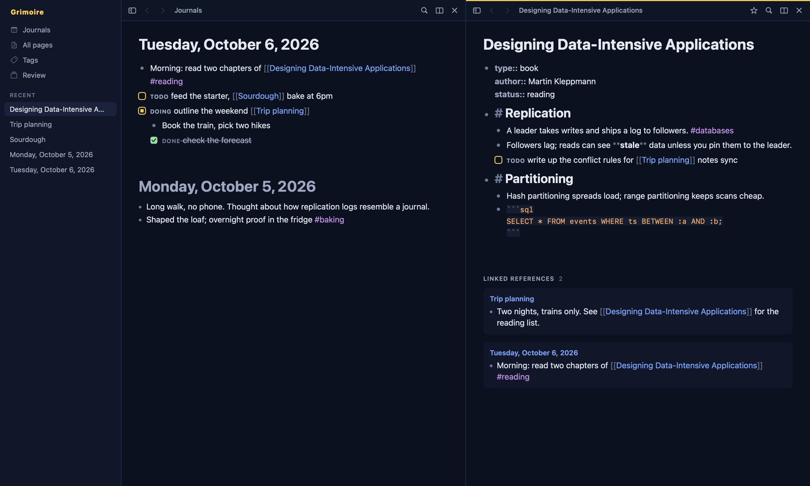

# Grimoire

[](https://github.com/nickjmorrow/grimoire/actions/workflows/ci.yml)


A local-first, outliner-style knowledge app for macOS and iOS: daily journals, linked pages, spaced-repetition flashcards, and a CLI and MCP server so AI tools can read and edit your notes.

It's a personal, single-user project, built as a native replacement for Logseq. The full design is in [docs/superpowers/specs](docs/superpowers/specs/2026-10-05-grimoire-design.md).



*Midnight Sun theme, with sample notes. Regenerate with `GRIMOIRE_SCREENSHOT=1 swift test --package-path UI --filter ScreenshotTests`.*

## Goals

- **Native and fast.** SwiftUI shell, AppKit/UIKit text editing, SQLite underneath; fully usable offline.
- **Your data, your machines.** One SQLite file per device, a readable Markdown mirror, and lossless JSON export. Sync runs through a server you host.
- **Themable everywhere.** One token-based JSON theme drives both the Mac and iPhone apps.
- **AI-native from the outside.** Claude Code and scripts drive the notes through a CLI and an MCP server. There is no chat panel inside the app, and every AI edit is attributed and undoable.

## Features

- **Outliner editor:** every page and journal is a tree of blocks, with Markdown inside each block.
- **Journals and pages:** continuous daily-journal scroll, `[[links]]`, `#tags`, `((block references))`, page properties.
- **References:** linked and unlinked backlinks under every page.
- **Search and command palette:** full-text search and a fuzzy ⌘K palette for pages, blocks, commands and themes.
- **Side-by-side panes** on Mac, with a sidebar of journals, favorites, recents and tags.
- **Flashcards:** `#card` blocks reviewed with the FSRS scheduler.
- **Diagrams as code:** Mermaid diagrams rendered in the editor.
- **Themes:** JSON token files that hot-reload; Midnight Sun (dark and light) ships first.
- **Offline-first sync:** an op log replicated through a small hub over a private network, with deterministic conflict rules.
- **Import and export:** import a Logseq graph (repeatable, report-first), always-on Markdown mirror, JSON export.
- **Backups and sync visibility:** `grim backup` keeps checked, thinned copies; the app lists anything sync couldn't apply under *Sync Issues* and backs off when the hub is unreachable.
- **Claude access:** the `grim` CLI and an MCP server expose the same operations; writes are recorded as an author so they can be reverted in one step.

## Tech stack

| Area | Choice |
|---|---|
| Language | Swift 6 (strict concurrency in Core) |
| UI | SwiftUI, with AppKit / UIKit text views for the block editor |
| Storage | SQLite via [GRDB](https://github.com/groue/GRDB.swift), FTS5 search |
| CLI | [swift-argument-parser](https://github.com/apple/swift-argument-parser) |
| Sync | Op log with a sequencing hub (`grim-sync`), HTTPS plus per-device bearer tokens |
| AI integration | MCP server (Python, stdio) wrapping the `grim` CLI |
| Diagrams | [Mermaid](https://mermaid.js.org) |
| Build | Swift Package Manager, [XcodeGen](https://github.com/yonaskolb/XcodeGen) for the app targets |
| CI | GitHub Actions |
| Testing | Swift Testing (about 150 tests in Core alone), Python `unittest` for the MCP server |

## Repository layout

```
Core/    GrimoireCore: data model, ops, indexes, import/export, mirror, FSRS, sync
UI/      GrimoireUI: editor, panes, palette, themes (shared by Mac and iOS)
App/     XcodeGen project for the macOS and iOS apps
CLI/     grim (command line) and grim-sync (sync hub)
mcp/     MCP server for AI tools
docs/    design spec
```

## Building

Requires macOS 15+, Xcode 16+ and [XcodeGen](https://github.com/yonaskolb/XcodeGen) (`brew install xcodegen`).

```bash
# Run the test suites
swift test --package-path Core
swift test --package-path CLI
swift test --package-path UI
python3 -m unittest discover -s mcp

# Build the Mac app into App/build.noindex
scripts/build-mac.sh Release
```

For iOS device builds, copy `.env.example` to `.env` and set `DEVELOPMENT_TEAM` to your Apple Developer team ID. `scripts/generate-project.sh` injects it when generating the Xcode project.

## Status

Active personal project. Milestone 1 (journals, pages, editor, search, sync, import, CLI and MCP) is the daily driver; Milestone 2 (flashcards, diagrams, integrations) is in progress. See the design spec for the roadmap.

## License

[MIT](LICENSE)
